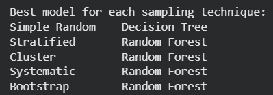
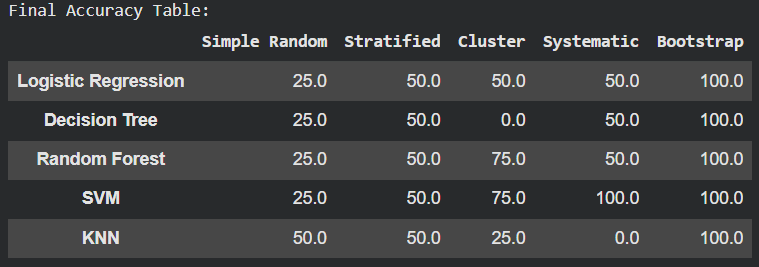
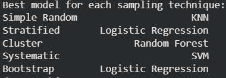

# Sampling Assignment – Credit Card Dataset
Lavanya Garg
102313066
# 📌 Objective
The objective of this assignment is to understand the importance of sampling techniques in handling imbalanced datasets and to analyze how different sampling strategies affect the performance of various machine learning models on a highly imbalanced credit card dataset.

---

# 📂 Dataset
The dataset used in this project is the Credit Card dataset obtained from the following GitHub repository:

https://github.com/AnjulaMehto/Sampling_Assignment/blob/main/Creditcard_data.csv

The dataset is highly imbalanced, where the majority class (Class = 0) significantly outweighs the minority class (Class = 1).

---

# ⚠️ Problem Statement
In real-world applications, imbalanced datasets can severely affect the performance of machine learning models.  
The objectives of this assignment are to:

- Convert the given dataset into a balanced class dataset  
- Create five different samples  
- Apply five different sampling techniques  
- Train five different machine learning models on each sample  
- Compare accuracy results and determine which sampling technique performs best for each model  

---

# 🔁 Step 1: Handling Class Imbalance

To study the effect of class balancing on model performance, **two separate experiments** were conducted:

---

# 🔹 Experiment A: Oversampling

In oversampling, the minority class (Class = 1) was increased to match the size of the majority class (Class = 0) by duplicating samples.  
This approach preserves all original data but may introduce overfitting due to repeated instances.

The oversampled dataset was then used as input for applying different sampling techniques and training machine learning models.

---

# 🔹 Experiment B: Undersampling

In undersampling, the majority class (Class = 0) was randomly reduced to match the size of the minority class (Class = 1).  
This approach avoids data duplication but may lead to loss of potentially useful information.

The undersampled dataset was independently used for applying the same sampling techniques and machine learning models.

---

# 📊 Step 2: Sampling Techniques Used

After balancing the dataset (separately for oversampling and undersampling), five different sampling techniques were applied:
```
| Sampling Name |         Technique      |
|---------------|------------------------| 
|   Sampling1   | Simple Random Sampling |
|   Sampling2   |   Systematic Sampling  |
|   Sampling3   |   Stratified Sampling  |
|   Sampling4   |    Cluster Sampling    |
|   Sampling5   |   Bootstrap Sampling   |
 
These techniques are based on probabilistic sampling methods discussed in the reference PPT.
```
---

# 🤖 Step 3: Machine Learning Models Used

Five machine learning models were trained on each sampled dataset:
```
| Model |           Algorithm          |
|-------|------------------------------|
|  M1   |      Logistic Regression     |
|  M2   |   Decision Tree Classifier   |
|  M3   |   Random Forest Classifier   |
|  M4   |   K-Nearest Neighbors (KNN)  |
|  M5   | Support Vector Machine (SVM) |
```
---

# 🧪 Step 4: Evaluation Metric

- Accuracy was used as the evaluation metric  
- Each model was trained and tested on each sampled dataset  
- Results were recorded in a **5 × 5 accuracy comparison matrix**  

---

## 📈 Results – Oversampling

### 🔹 Accuracy Matrix (Oversampling)


### 🔹 Best Model per Sampling Technique (Oversampling)


---

## 📈 Results – Undersampling

### 🔹 Accuracy Matrix (Undersampling)


### 🔹 Best Model per Sampling Technique (Undersampling)



---

#  Final Observations & Conclusions

- **Oversampling vs Undersampling**: Oversampling generally produced higher accuracy values, including perfect accuracy in some cases, due to repeated samples and potential overfitting. Undersampling resulted in more varied accuracy values, highlighting the impact of reduced dataset size on model performance.

- **Best Performing Models**: Tree-based models such as Random Forest performed consistently well under both balancing strategies, demonstrating their robustness with imbalanced data.

- **Optimal Sampling Techniques**: Stratified and Bootstrap sampling techniques often provided stable and high accuracy across models, making them preferred choices for handling imbalanced datasets.

- **Key Insight**: The experiments demonstrate that both class balancing techniques and sampling strategies significantly influence machine learning performance. Selecting an appropriate balancing method and sampling technique is crucial for achieving reliable results on imbalanced datasets.

---

# ▶️ How to Run the Project

1. Open the project folder in VS Code or Google Colab  
2. Install required libraries:
   ```bash
   pip install pandas numpy scikit-learn imbalanced-learn matplotlib seaborn
   ```
3. Run the notebook cells sequentially
4. View results and visualizations in the `images/` folder

